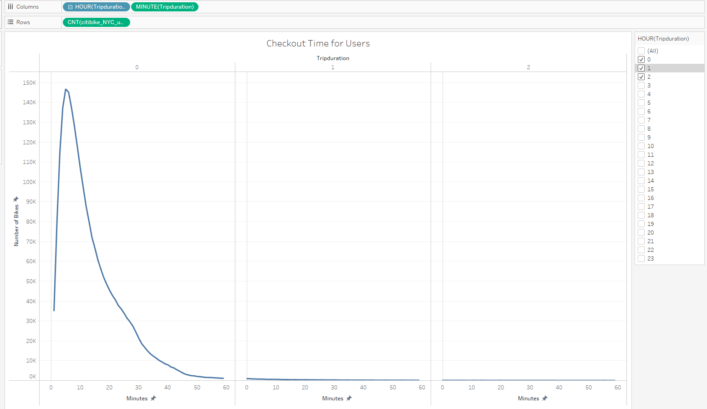
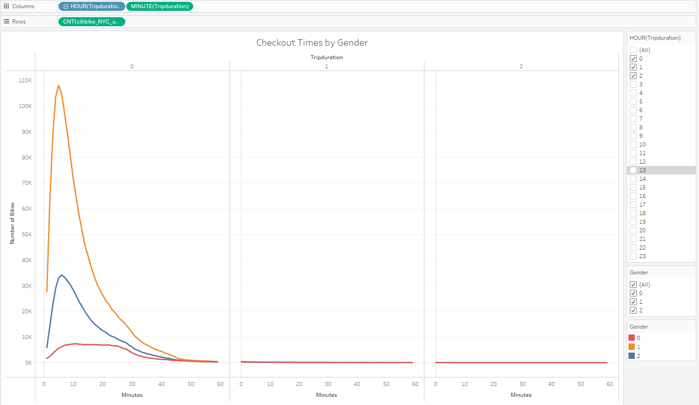
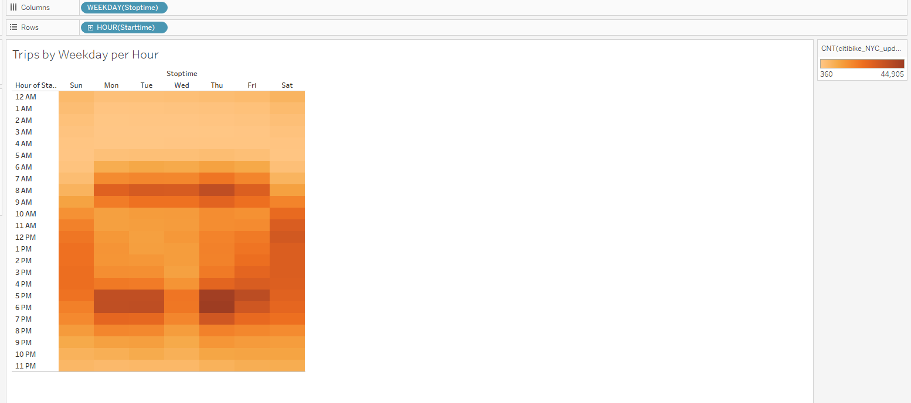
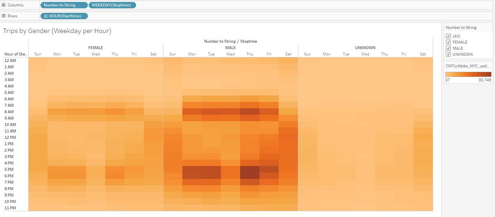
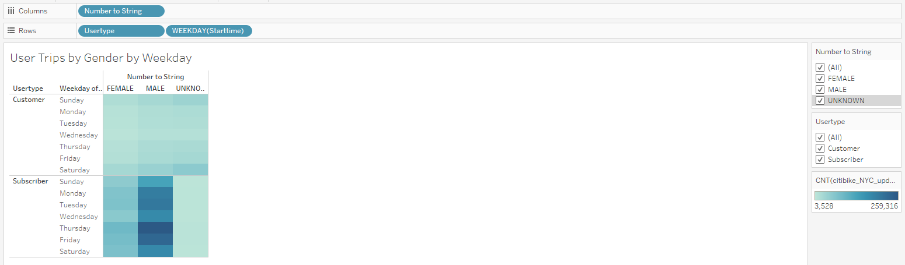
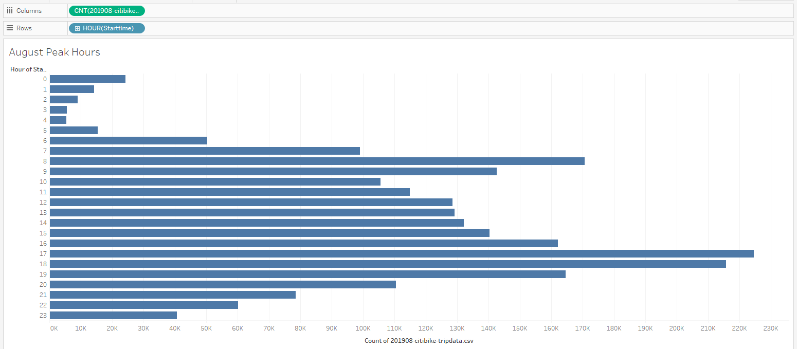
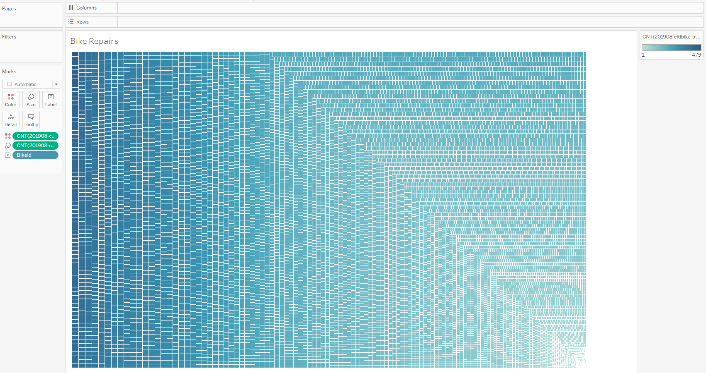

# bikesharing

## Overview
The purpose of this analysis was to convince investors that creating a bike-share program in Des Moines, Iowa is a good business proposal. One of the key stakeholders requested to see a bike trip analysis. To do this, the data was analyzed and visualized through Tableau using appropriate filters to help the data tell a story. Specifically, the length of time that bikes were check out were analyzed for all riders and further analyzed by the gender of the riders. Additionally, the length of the bike trips were analyzed for all rides based on their gender for each hour and each day of the week. Moreover, the number of bike trips for each user type and their gender were analyzed for each day of the week. In order to due this, we used the August 2019 ride data collected from New York City's CitiBike bike-share program. First, the CSV file holding the data was converted to a DataFrame with Python Pandas. Then it was imported into Tableau and filtered out accordingly to create the relevant visualizations. Finally, the visualizations were compiled into a Tableau story along with the August Peak Hours visualization and the Bike Repair visualization to really show the investors how might it be pertinent and translate to the success rate of a potential bike sharing program in Des Moines.

## Results
The results can be analyzed in the visualizations below:

### Checkout Times for Users

Based on this visualization it appears that the most frequent duration of bikes checked out appear to be within 5-10 minutes, with the peak number of bikes reaching close to 150,000. This means that most riders who check out bikes usually only ride for around 5-10 minutes. There is a sharp decrease in bikes checkout out after this time frame, indicating that after aroun5-10 minutes, many of theese riders gradually begin to finish their ride and return the bikes.

### Checkout Times by Gender

Similar to the previous visualization, it appears that the highest number of bikes checked out at the highest minute duration is around 5-10 minutes, with male bikers encompassing the majority of the checkout times. However all genders follow a similar pattern in the amount of the time that is spent checked out and riding, with the peak time somewhere around 5-10 minutes. Beforehand, there is a sharp increase and after the peak, there is a sharp decrease seen across all genders. There are very minimal to no riders regardless of gender who have bikes checked out past around 55 minutes.

### Trips by Weekday for Each Hour

This heatmap visualization is a great way to display the hot spots of when trips are at their highest or loewst points by weekday and per each hour. The darker the shade, the more trips that were active. Lighter shades indicate lower trip activity. From this heatmap we can see that during the weekdays, there appeared to be the highest amount of trip activity between the hours of 5PM-6PM, probably as a means for people to get home on their evening commute or perhaps a leisurely evening bike ride after work. The shades on Saturday and Sunday showed there was consistent ridership throughout the daytime hours. And as expected, the lowest amount of trip activity was during the late night and early morning hours, regardless of the day of the week.  

### Trips by Gender (Weekday per Hour)

This visualization is similar to the previous one except that the genders are split into their own heatmaps. However, we can still see that the pattern is the same. The weekdays experienced peak bike trips during the morning hour of 8AM and the evening hours in the 5PM-6PM time range, the daytime hours of Saturdays and Sundays were active, and the nightime to early morning hours were the least active across all genders. It is noteworthy that the shades are much darker for the males heatmap, indicating that males are overall more avtice in ridership than females.

### User Trips by Gender by Weekday

In this heatmap, the popular ride times of each weekday were detailed, separated by gender as well as the usertype. Usertype differentiates whether the user was a subscriber or a customer. The darker shades are in the subscriber portion, indicating most of the active riders were subscribers, with the darkest shades in the Male column, indicating that the majority of riders whom are also subscribers are males. Interestingly enough, the darkest shade is on Thursday. It could be interesting to dive deeper into the analysis as to why this is the most active day of the week for ridership. The Unknown column in the subscriber portion is a single light shade. This likely signifies that none of those whose genders are 'Unknown' are subscribers OR that each weekday for unknown gendered subscribers resulted in the same level of ridership activity, which is less likely.

### August 2019 Peak Riding Hours

This visualization is a bar chart that further cements information we established earlier and already know. It shows the sum amount of ridership per hour of each day. However, with this spedific chart, it was noteworthy to point out the lowest peak hours. Bikes will ineveitable need to go through maintenance as they get used. To minimize affecting the availablity of bikes and thus the customer base, it would be recommended to perform maintenance during the hours with the lowest amount of ridership, which would be the early morning hours between 2AM-5AM.

### Bikes Due for Repair

In conjunction with the previous visualization showing the lowest peak hours that are most optimal for conducting bike maintenance, it is also important to determine which bikes are most likely to need repairs based on the amount of use they receive. To determine this, this visualization was created that uses shades of a color to indicate the frequency of records attached to each Bike ID. The darker the shade, the more records exist for that Bike ID, indicating that those partiuclar bikes get used the most often. Investors can stay ahead of bike keep-up by closely monitoring which BikeIDs are accumulating more records and directing maintenance for them during the peak lowest ridership hours. 

## Summary
From these results, we can see some logical and expected patterns. Bike ridership activity is concentrated in the the morning and evening hours of the weekdays and during the daytime hours on the weekends. Overall, most of those who use the CitiBike program are subscribers and most of them are males. The majority of ride durations tend to fall within the 5-10 minute range.

Two additional visualizations can help provide further analysis. One would to be examine visualizations of the same filters but for a different month, perhaps a winter month. New York City and Des Moines, Iowa are both prone to somewhat similar seasonal weather patterns. It would be interesting to analyze the data during a cold, perhaps snow-prone month like January. How the numbers are affected could and would drastically change the visualizations. The other visualization we can create is .
